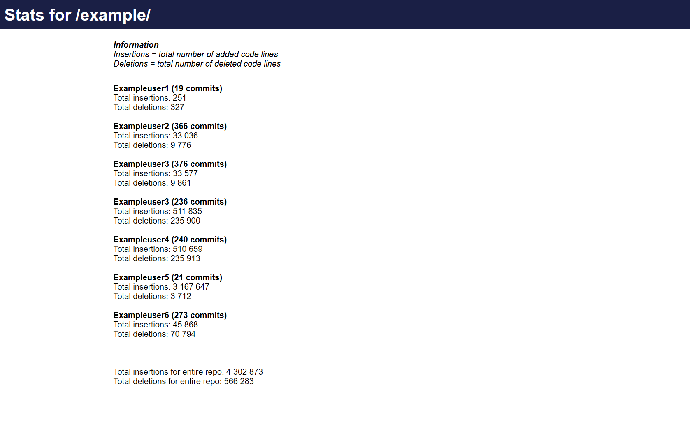

# Git repository stats viewer 
Generate a static html page with information about git commits 



# How to generate a new static html file
Run for the repository the app.js file is located in
```
node app.js  
```
Run for path
```
node app.js ~/Desktop/repo_name
```
Run for another path and export index.html into another 
```
node app.js ~/Desktop/repo_name ~/Desktop/export
```
Run same path as app.js but export index.html into another path
```
node app.js . ~/Desktop/export
```
# compile
npm install -g pkg  
pkg app.js  

# requirements
git/git bash for windows  
node  
