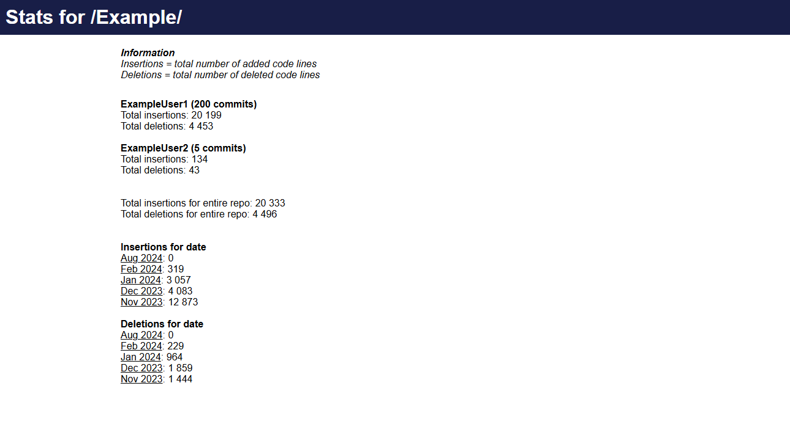

# Git repository stats viewer 
Generate a static html page with information about git commits 

# Requirements
git or "git bash for windows"  
node 

# How to generate a new static html file
There are several ways to generate a new report.  
Here are some examples:  
  
Run for the repository the app.js file is located in
```
node app.js  
```
Run for path
```
node app.js ~/Desktop/repo_name/
```
Run for another path and export static html file to another folder
```
node app.js ~/Desktop/repo_name/ ~/Desktop/export/
```
Run same path as app.js but export static html file to another path
```
node app.js . ~/Desktop/export/
```
You can define a custom export file name 
```
node app.js ~/Desktop/repo_name/ ~/Desktop/export/ test.html
```


# Example
